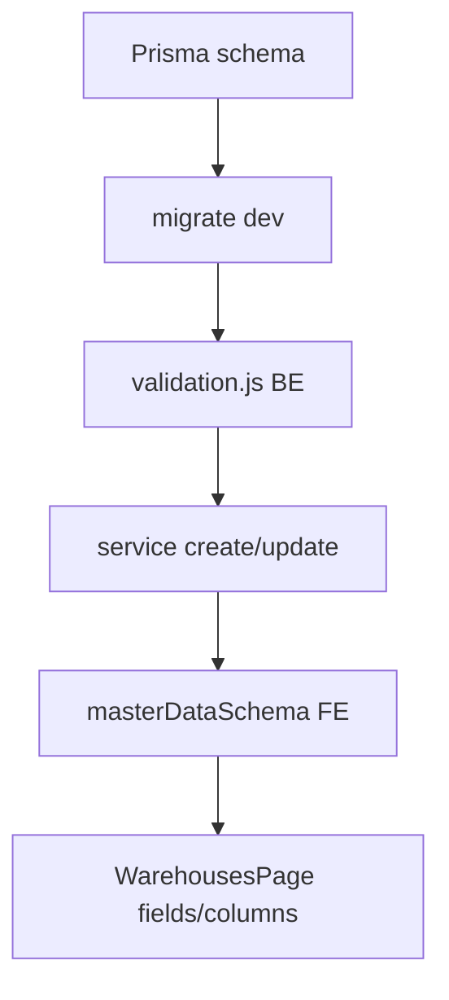

# Warehouse – Developer Guide

## Overview

Hướng dẫn kỹ thuật cho developer làm việc với module warehouse: setup, mở rộng, debug và tích hợp module khác.

## Purpose

Rút ngắn thời gian onboard và đảm bảo thay đổi nhất quán với pattern master data WMS.

## Scope

Backend `backend/src/modules/warehouse/`, frontend warehouses feature, liên kết inventory và phiếu.

## Workflow

### Chạy local

1. Backend: `cd backend && npm run dev`
2. Frontend: `cd frontend && npm run dev`
3. Login user có permission `warehouse:*`
4. Truy cập `/warehouses`

### Thêm field mới (checklist dev)



## Business Rules

Khi mở rộng, giữ nguyên WH-BR-01 (unique code) và WH-BR-05 (soft delete). Module tiêu thụ (goods-receipt) cần validate ACTIVE nếu dùng entity mới.

## Technical Design

**Pattern tham chiếu:** product module — cùng cấu trúc file.

| Task | Location |
|------|----------|
| Sửa API contract | `warehouse.validation.js`, `warehouse.service.js` |
| Sửa UI form | `WarehousesPage.jsx` fields array |
| Permission seed | Prisma seed / role module |
| Route FE | Router config (app routes) |

**Tích hợp module khác:**

```javascript
// goodsReceipt.service.js — pattern validate warehouse
if (!warehouse || warehouse.status !== 'ACTIVE') {
  throw new ApiError(...);
}
```

**API client:** `warehouseApi` trong `masterDataApi.js`

## API / Database

- [api.md](./api.md) — endpoint reference
- [database.md](./database.md) — schema

Migration: `npx prisma migrate dev` sau khi sửa schema.

## Validation

Đồng bộ BE Zod và FE Zod. FE có thể lỏng hơn nhưng không mâu thuẫn (vd email).

Chạy test validation nếu thêm schema test: pattern từ `masterDataSchema.test.js`.

## Security

Thêm permission mới (nếu có):

1. Seed permission code
2. Gán role
3. `authorize('warehouse:new-action')` trên route
4. `usePermissions()` trên FE

## Error Handling

Debug:

| Triệu chứng | Kiểm tra |
|-------------|----------|
| 403 | Role thiếu permission |
| 409 | Trùng code — query `warehouses` |
| 404 | UUID sai hoặc bản ghi không tồn tại |
| FE không refresh | queryKey `warehouses` invalidate |

Log: Express error middleware; Prisma query log bật ở dev.

## Examples

**Gọi API từ script test**

```javascript
const res = await api.get('/warehouses', { params: { limit: 100, status: 'ACTIVE' } });
```

**Thêm cột bảng FE**

```javascript
const columns = [
  ...existing,
  { key: 'email', label: 'Email' },
];
```

**Reuse list ACTIVE cho dropdown** (module khác): gọi `GET /warehouses?status=ACTIVE&limit=100`.

## Design Decisions

| Quyết định | Ghi chú dev |
|------------|-------------|
| Không tách warehouseApi file riêng | Cùng masterDataApi với 3 module kia |
| Service không gọi audit | Thêm audit.service nếu compliance yêu cầu |
| Repository không filter soft-delete mặc định | List trả cả INACTIVE — FE filter |

## Notes

- Base API path: `/api/v1/warehouses` (prefix v1 trong app.js)
- Chưa có integration test warehouse — tham khảo pattern `p0.integration.test.js`
- Giả định PostgreSQL + Prisma 5+

## Checklist

- [ ] Prisma migrate sau schema change
- [ ] BE + FE validation sync
- [ ] Permission seed updated
- [ ] Manual test create/update/delete
- [ ] Kiểm tra goods-receipt vẫn chọn được kho ACTIVE
- [ ] Cập nhật docs api/database nếu đổi contract
