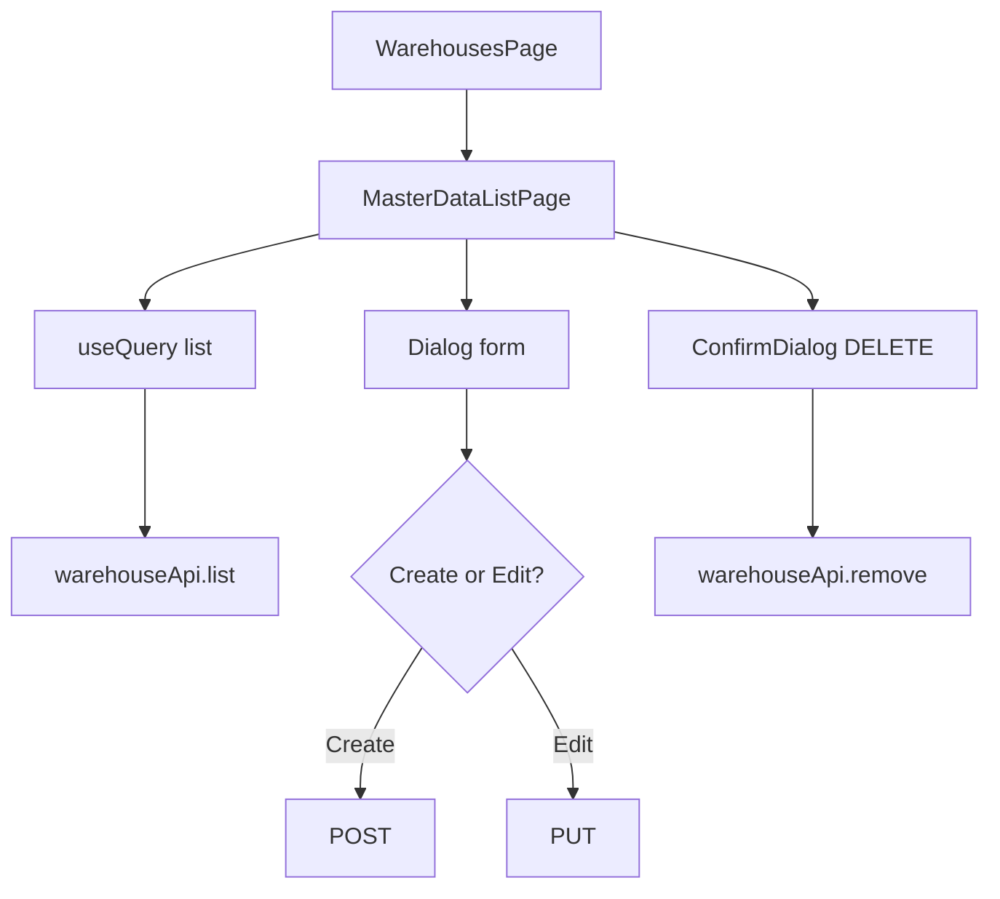

# Warehouse – Frontend

## Overview

Giao diện quản lý kho tại route `/warehouses`, xây dựng trên component dùng chung `MasterDataListPage` với cấu hình riêng cho warehouse.

## Purpose

Mô tả cấu trúc UI, luồng tương tác người dùng và tích hợp API phía client.

## Scope

| Trong phạm vi | Ngoài phạm vi |
|--------------|---------------|
| List, search, filter status | Chọn kho trên phiếu (module khác) |
| Dialog create/edit | Upload ảnh kho |
| Soft delete confirm | Restore INACTIVE qua UI |

## Workflow

## Business Rules

| ID | Hiển thị UI |
|----|-------------|
| WH-BR-03 | Nút Xóa chỉ với `status === ACTIVE` |
| WH-BR-01 | Form bắt buộc code + name |
| Permissions | Nút Thêm/Sửa/Xóa theo `warehouse:*` |

## Technical Design

| Thành phần | Path |
|-----------|------|
| Page | `frontend/src/features/warehouses/pages/WarehousesPage.jsx` |
| Shared UI | `frontend/src/features/master-data/components/MasterDataListPage.jsx` |
| API client | `frontend/src/features/master-data/api/masterDataApi.js` → `warehouseApi` |
| Schema | `frontend/src/features/master-data/schemas/masterDataSchema.js` → `warehouseSchema` |

**Stack:** React, React Hook Form, Zod resolver, TanStack Query, shadcn/ui.

**Cấu hình WarehousesPage**

| Prop | Giá trị |
|------|---------|
| `queryKey` | `"warehouses"` |
| `permissions.create` | `warehouse:create` |
| `permissions.update` | `warehouse:update` |
| `permissions.delete` | `warehouse:delete` |

**Form fields:** code, name, address (textarea), phone, email, description (textarea)

**Table columns:** code, name, phone, address + StatusBadge + actions

## API / Database

API: [api.md](./api.md) · DB: [database.md](./database.md)

Client gọi qua axios instance `@/lib/axios` (base URL + interceptors auth).

## Validation

`warehouseSchema` (FE):

| Field | Rule |
|-------|------|
| code | required, trim |
| name | min 2 |
| email | email hoặc rỗng |

Chuỗi rỗng gửi lên API được convert `null` trong `onSubmit` (trừ field number).

FE validation nhẹ hơn BE (không max length đầy đủ) — BE là source of truth.

## Security

- `usePermissions()` ẩn/hiện nút theo role
- Token gắn qua axios interceptor (module auth)
- Không lưu dữ liệu kho ở localStorage

## Error Handling

| Nguồn | Xử lý |
|-------|-------|
| List query fail | Banner đỏ `error.response.data.message` |
| Form submit fail | `formError` trong dialog |
| Fallback | `'Có lỗi xảy ra'` |

## Examples

**Mở trang:** Menu → Kho hàng → `/warehouses`

**Tạo kho:** Thêm mới → điền WH-001, Kho chính → Lưu → invalidate query `warehouses`

**Tìm kiếm:** Gõ vào ô "Tìm kiếm..." → reset page 1 → refetch

## Design Decisions

| Quyết định | Lý do | Trade-off |
|------------|-------|-----------|
| MasterDataListPage | 4 master modules giống nhau | Ít tùy biến UI riêng |
| limit=10 cố định | UX đơn giản | Không cho user chọn page size |
| Empty string → null | Khớp API nullable | Cần logic trong onSubmit |

## Notes

- Pagination component: `@/components/shared/Pagination`
- StatusBadge map ACTIVE/INACTIVE sang label tiếng Việt
- Chưa có sort column trên UI (API hỗ trợ sortBy)

## Checklist

- [x] Route và file paths chính xác
- [x] Fields/columns khớp WarehousesPage.jsx
- [x] Permission keys documented
- [ ] E2E test warehouse CRUD (chưa có)
