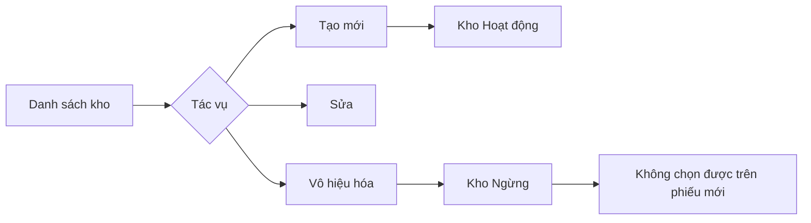

# Warehouse – Hướng dẫn người dùng

## Overview

Hướng dẫn thao tác quản lý **Kho hàng** trên giao diện WMS dành cho Admin hoặc user được cấp quyền warehouse.

## Purpose

Giúp người dùng nghiệp vụ biết cách tạo, tra cứu, cập nhật và vô hiệu hóa kho mà không cần đọc code.

## Scope

Trang **Kho hàng** (`/warehouses`). Không hướng dẫn nhập/xuất kho — xem module phiếu tương ứng.

## Workflow

### Xem danh sách kho

1. Đăng nhập WMS
2. Menu → **Kho hàng**
3. Dùng ô tìm kiếm (mã, tên, địa chỉ)
4. Lọc trạng thái: Tất cả / Hoạt động / Ngừng

### Tạo kho mới

1. Bấm **Thêm mới** (cần quyền tạo)
2. Nhập **Mã kho** (vd: `WH-001`) và **Tên kho** (bắt buộc)
3. Điền địa chỉ, điện thoại, email, mô tả nếu có
4. **Lưu** — hệ thống chuẩn hóa mã in hoa

### Sửa thông tin kho

1. Bấm biểu tượng bút trên dòng kho
2. Chỉnh sửa field cần thiết → **Lưu**

### Vô hiệu hóa kho

1. Bấm biểu tượng thùng rác (chỉ kho **Hoạt động**)
2. Xác nhận trong hộp thoại
3. Trạng thái chuyển **Ngừng** — không xóa hẳn dữ liệu

## Business Rules

| Quy tắc | Ý nghĩa với user |
|---------|------------------|
| Mã kho không trùng | Nếu báo lỗi trùng mã, đổi mã khác |
| Kho Ngừng | Vẫn thấy trong danh sách (lọc Ngừng), không dùng phiếu mới |
| Không xóa vĩnh viễn | Lịch sử phiếu cũ vẫn hiển thị tên kho |
| Email sai định dạng | Form báo lỗi trước khi gửi |

## Technical Design

Không áp dụng — xem [frontend.md](./frontend.md) nếu cần chi tiết kỹ thuật.

## API / Database

Không áp dụng — người dùng thao tác qua UI. Admin kỹ thuật: [api.md](./api.md).

## Validation

| Field | Yêu cầu |
|-------|---------|
| Mã kho | Bắt buộc |
| Tên kho | Tối thiểu 2 ký tự |
| Email | Đúng định dạng nếu nhập |

## Security

Chỉ user có quyền mới thấy nút tương ứng. Không có quyền → chỉ xem danh sách (nếu có `warehouse:read`).

## Error Handling

| Thông báo | Cách xử lý |
|-----------|------------|
| Mã kho đã tồn tại | Đổi mã |
| Có lỗi xảy ra | Thử lại; liên hệ IT nếu lặp lại |
| Không có dữ liệu | Tạo kho đầu tiên hoặc bỏ bộ lọc |

## Examples

| Tình huống | Thao tác |
|------------|----------|
| Mở kho chi nhánh mới | Tạo `WH-HN`, tên "Kho Hà Nội", điền địa chỉ |
| Ngừng kho cũ | Vô hiệu hóa — phiếu mới chọn kho khác |
| Tìm kho theo SĐT | Gõ số điện thoại vào ô tìm kiếm (nếu đã lưu trong phone) |

*Lưu ý: tìm kiếm API không index phone — chỉ code, name, address. Tìm SĐT có thể không ra kết quả.*

## Design Decisions

Giao diện thống nhất với Sản phẩm/NCC/KH để giảm thời gian đào tạo.

## Notes

- Kích hoạt lại kho Ngừng: chưa có nút UI — cần IT qua API PATCH status
- Trước khi vô hiệu hóa, kiểm tra không còn phiếu nháp cần kho đó (nghiệp vụ tự kiểm tra khi submit)

## Checklist

- [x] Các bước CRUD trên UI
- [x] Giải thích soft delete
- [x] Quyền cần thiết
- [ ] Video hướng dẫn (optional)
