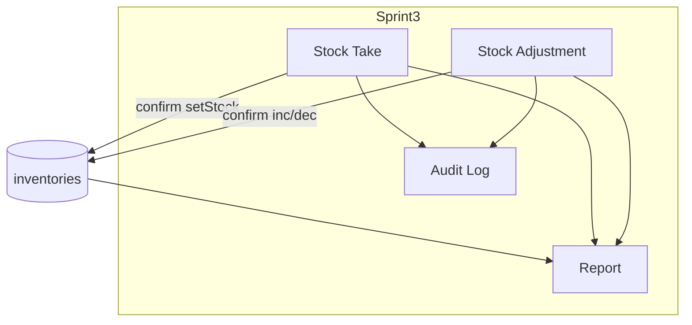

# Sprint 3 – Control & Reporting

## Overview

Sprint 3 hoàn thiện **kiểm soát tồn kho** (Stock Take, Stock Adjustment), **nhật ký hoạt động** (Audit Log) và **báo cáo xuất file** (Report). Code đã triển khai; deploy production theo [deploy.md](./deploy.md).

## Purpose

Đóng vòng quản lý kho: đối chiếu tồn (ST) → điều chỉnh lệch (SA) → truy vết (Audit) → báo cáo (Report).

## Scope

| Module | Trạng thái |
|--------|------------|
| Stock Take | ✅ Backend + FE |
| Stock Adjustment | ✅ Backend + FE |
| Audit Log | ✅ Read API + FE + ghi từ ST/SA/GR/GI/Auth |
| Report | ✅ 6 loại + Excel/PDF |
| Deploy docs | 📋 Hướng dẫn, chưa thực hiện |

**Ngoài phạm vi Sprint 3:** Approval workflow, Batch/Lot/Serial, Barcode, Multi-company, Realtime, AI.

## Workflow



## Business Rules

| # | Quy tắc chung |
|---|---------------|
| 1 | Tồn kho tại bảng `inventories` (warehouse + product) |
| 2 | Chứng từ ST/SA: DRAFT → CONFIRMED / CANCELLED |
| 3 | Chỉ **Confirm** thay đổi tồn (transaction) |
| 4 | Không sửa/hủy phiếu CONFIRMED (MVP) |
| 5 | ST: system_qty snapshot; confirm → counted_qty |
| 6 | SA: INCREASE/DECREASE; DECREASE không âm tồn |
| 7 | Audit: append-only read model |
| 8 | Report: GR/GI/ST/SA chỉ CONFIRMED |

## Technical Design

### Thứ tự triển khai khuyến nghị

| # | Module | Lý do |
|---|--------|-------|
| 1 | Stock Take | Chuẩn hóa tồn thực tế |
| 2 | Stock Adjustment | Xử lý lệch/hư/mất |
| 3 | Audit Log | Ghi confirm nhạy cảm |
| 4 | Report | Phụ thuộc dữ liệu ST/SA |
| 5 | Docs / Test / Deploy | DoD |

### Permissions

```
stock-take:read|create|update|delete
stock-adjustment:read|create|update|delete
report:read|export
audit-log:read
```

Staff: chủ yếu `:read`; Manager/Admin: đủ quyền nghiệp vụ.

## API / Database

| Module | Base path |
|--------|-----------|
| Stock Take | `/api/v1/stock-takes` |
| Stock Adjustment | `/api/v1/stock-adjustments` |
| Audit Log | `/api/v1/audit-logs` |
| Report | `/api/v1/reports/:type` |

Prisma models: StockTake, StockTakeItem, StockAdjustment, StockAdjustmentItem, AuditLog.

## Validation

Zod trên ST/SA routes; Report type regex trên route; Audit list query validated.

## Security

JWT toàn bộ Sprint 3 API. Export report tách permission `report:export`. Audit read-only API.

## Error Handling

409 conflict: phiếu không DRAFT, DECREASE không đủ tồn. Audit write fail không rollback nghiệp vụ.

## Examples

Smoke flow: Login → GR confirm → GI confirm → ST confirm → SA confirm → Report export Excel → Audit list filter module stock-take.

## Design Decisions

| Quyết định | Lý do |
|------------|-------|
| Pattern document giống GR/GI | Giảm cognitive load |
| Audit best-effort | Uptime ưu tiên |
| Report không materialized views | MVP simplicity |
| Deploy tách sprint | Code ready trước hạ tầng |

## Notes

Tài liệu module chi tiết:

- [Stock Take](../modules/stock-take/README.md)
- [Stock Adjustment](../modules/stock-adjustment/README.md)
- [Audit Log](../modules/audit-log/README.md)
- [Report](../modules/report/README.md)

Deploy: [deploy.md](./deploy.md)

## Checklist

- [x] 4 module nghiệp vụ code
- [x] Docs module Sprint 3
- [ ] Integration test P0 đầy đủ
- [ ] Swagger đủ endpoint
- [ ] Production deploy
- [ ] Cập nhật docs/README.md + sprint plan
