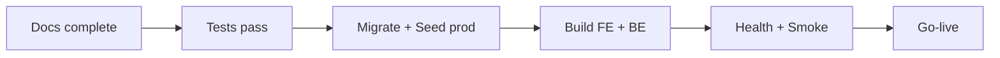

# Sprint 3 – Docs / Test / Deploy

## Overview

Checklist hoàn thiện Definition of Done Sprint 3: tài liệu, kiểm thử và triển khai production cho WMS.

## Purpose

Hướng dẫn team đóng sprint với chất lượng deploy-ready.

## Scope

Documentation, testing, deployment MVP (PostgreSQL + Node backend + static frontend). Không bao gồm Kubernetes enterprise.

## Workflow



## Business Rules

DoD Sprint 3:

- 4 module nghiệp vụ hoàn thành theo DoD nội bộ
- Báo cáo export Excel + PDF
- Audit log ghi sự kiện then chốt (confirm ST/SA/GR/GI, auth)
- Tài liệu + hướng dẫn chạy production

## Technical Design

### Documentation checklist

| Hạng mục | Trạng thái |
|----------|------------|
| Docs 4 module Sprint 3 (README, analysis, api, database, frontend, backend, user-guide, developer-guide) | ✅ |
| Cập nhật `docs/README.md` + `docs/02-sprint-plan.md` | ⬜ |
| Swagger đủ endpoint mới | ⬜ |
| README root: env, seed, deploy scripts | ⬜ |

### Testing checklist

| Loại | Nội dung |
|------|----------|
| Unit | ST/SA confirm logic, report calc, audit sanitize |
| Integration | ST/SA/Report/Audit happy + 401/403/404/409 |
| FE | schemas + critical forms (stockTakeSchema, stockAdjustmentSchema) |
| Smoke E2E | login → GR confirm → GI confirm → ST → SA → Report export → Audit list |

Chạy backend tests:

```bash
cd backend
npm test
```

Integration (nếu có `.env.test`):

```bash
npm run test:integration
```

### Deploy architecture (MVP)

| Thành phần | Gợi ý |
|------------|--------|
| PostgreSQL | Supabase / Neon / Railway hoặc VPS |
| Backend | Railway / Render / VPS (Node 20+) |
| Frontend | Vercel / Cloudflare Pages / Nginx static |
| Object storage | Cloudflare R2 (scaffold sẵn nếu dùng) |

### Biến môi trường

| Biến | Mô tả |
|------|-------|
| DATABASE_URL | PostgreSQL connection string |
| JWT_ACCESS_SECRET, JWT_REFRESH_SECRET | Auth tokens |
| CORS_ORIGIN | URL frontend production |
| VITE_API_BASE_URL | FE → API (build time) |
| R2_* | Nếu bật upload file |

## API / Database

### Bước deploy tối thiểu

1. `npx prisma migrate deploy` (hoặc `db push` nếu chấp nhận rủi ro schema drift)
2. `npm run db:seed` — roles, permissions, admin user
3. Build backend: `npm run build` hoặc `node src/server.js` với PM2
4. Build frontend: `npm run build` → deploy `dist/`
5. Trỏ `VITE_API_BASE_URL` tới API production
6. Health check: `GET /api/v1/health`
7. Login admin seed → smoke Sprint 3 flow

### Post-deploy verify

| Kiểm tra | Kỳ vọng |
|----------|---------|
| Health | 200 OK |
| ST confirm | Inventory cập nhật counted_qty |
| SA DECREASE vượt tồn | 409 |
| Report export | File .xlsx / .pdf tải được |
| Audit | Row STOCK_TAKE_CONFIRM xuất hiện |

## Validation

Chạy migration trên staging trước prod. Không commit `.env` secrets.

## Security

HTTPS bắt buộc production. Rotate JWT secrets. CORS chỉ whitelist FE domain. Principle least privilege trên DB user.

## Error Handling

Rollback deploy: giữ backup DB trước migrate. PM2/systemd restart policy cho backend.

## Examples

Railway: connect Postgres plugin → set env → deploy from GitHub → run migrate in deploy command.

## Design Decisions

| Quyết định | Lý do |
|------------|-------|
| Managed Postgres | Giảm ops cho MVP cá nhân |
| Static FE + API riêng | Chuẩn SPA |
| migrate deploy vs db push | migrate cho prod an toàn |

## Notes

- File mẫu env test: `backend/.env.test.example`
- Integration scaffold: `backend/src/__tests__/integration/`
- Deploy sprint 3 có thể thực hiện sau khi test xanh

## Checklist

### Docs
- [x] Module docs Sprint 3 rewritten
- [ ] Root docs index
- [ ] Swagger complete

### Test
- [ ] Unit ST/SA/report/audit
- [ ] Integration P0
- [ ] FE schema tests CI
- [ ] Manual smoke script

### Deploy
- [ ] Staging environment
- [ ] Prod migrate + seed
- [ ] FE build + CDN
- [ ] Monitoring / logs
- [ ] Backup schedule
