# WMS Database

## Overview

Schema PostgreSQL của WMS (Prisma). **19 tables · 29 FK · 4 enums**.

> Source of truth: `backend/prisma/schema.prisma`  
> DrawDB: [`wms-database.drawdb.json`](./wms-database.drawdb.json)

## Purpose

Cung cấp ERD và danh mục bảng/FK/enum để:

| Ai | Dùng để |
|----|---------|
| Backend developer | Thiết kế repository / migration |
| BA / Architect | Hiểu quan hệ nghiệp vụ |
| Frontend | Biết shape dữ liệu chính |

## Scope

| Trong phạm vi | Ngoài phạm vi |
|---------------|---------------|
| Toàn bộ bảng MVP Sprint 1–3 | Index vật lý chi tiết từng môi trường |
| PK/FK/unique/enum | Query tối ưu từng báo cáo |

Chi tiết cột theo module: `docs/modules/*/database.md`.

## Workflow

```text
Prisma schema
↓
prisma generate / db push (dev)
↓
Application qua Repository
↓
Thay đổi tồn kho chỉ khi confirm chứng từ
```



```mermaid
erDiagram
    roles ||--o{ users : "role_id"
    roles ||--o{ role_permissions : "role_id CASCADE"
    permissions ||--o{ role_permissions : "permission_id CASCADE"
    users ||--o{ refresh_tokens : "user_id CASCADE"
    users ||--o{ audit_logs : "user_id SET NULL"

    warehouses ||--o{ inventories : "warehouse_id"
    products ||--o{ inventories : "product_id"

    warehouses ||--o{ goods_receipts : "warehouse_id"
    suppliers ||--o{ goods_receipts : "supplier_id"
    users ||--o{ goods_receipts : "created_by / confirmed_by"
    goods_receipts ||--o{ goods_receipt_items : "CASCADE"
    products ||--o{ goods_receipt_items : "product_id"

    warehouses ||--o{ goods_issues : "warehouse_id"
    customers ||--o{ goods_issues : "customer_id"
    users ||--o{ goods_issues : "created_by / confirmed_by"
    goods_issues ||--o{ goods_issue_items : "CASCADE"
    products ||--o{ goods_issue_items : "product_id"

    warehouses ||--o{ stock_takes : "warehouse_id"
    users ||--o{ stock_takes : "created_by / confirmed_by"
    stock_takes ||--o{ stock_take_items : "CASCADE"
    products ||--o{ stock_take_items : "product_id"

    warehouses ||--o{ stock_adjustments : "warehouse_id"
    users ||--o{ stock_adjustments : "created_by / confirmed_by"
    stock_adjustments ||--o{ stock_adjustment_items : "CASCADE"
    products ||--o{ stock_adjustment_items : "product_id"

    roles {
        uuid id PK
        string name UK
        string description
        timestamptz created_at
        timestamptz updated_at
    }

    permissions {
        uuid id PK
        string code UK
        string name
        string module
        timestamptz created_at
        timestamptz updated_at
    }

    role_permissions {
        uuid role_id PK_FK
        uuid permission_id PK_FK
    }

    users {
        uuid id PK
        string email UK
        string password_hash
        string full_name
        string avatar_url
        UserStatus status
        uuid role_id FK
        int failed_login_attempts
        timestamptz locked_until
        timestamptz last_login_at
        timestamptz created_at
        timestamptz updated_at
    }

    refresh_tokens {
        uuid id PK
        uuid user_id FK
        string token_hash UK
        timestamptz expires_at
        timestamptz revoked_at
        string ip_address
        string user_agent
        timestamptz created_at
    }

    warehouses {
        uuid id PK
        string code UK
        string name
        string address
        string phone
        string email
        string description
        EntityStatus status
        timestamptz created_at
        timestamptz updated_at
    }

    products {
        uuid id PK
        string code UK
        string name
        string description
        string category
        string unit
        decimal price
        decimal cost_price
        int min_stock
        string image_url
        EntityStatus status
        timestamptz created_at
        timestamptz updated_at
    }

    suppliers {
        uuid id PK
        string code UK
        string name
        string contact_person
        string phone
        string email
        string address
        string notes
        EntityStatus status
        timestamptz created_at
        timestamptz updated_at
    }

    customers {
        uuid id PK
        string code UK
        string name
        string contact_person
        string phone
        string email
        string address
        string notes
        EntityStatus status
        timestamptz created_at
        timestamptz updated_at
    }

    inventories {
        uuid id PK
        uuid warehouse_id FK
        uuid product_id FK
        decimal quantity
        timestamptz created_at
        timestamptz updated_at
    }

    goods_receipts {
        uuid id PK
        string code UK
        uuid warehouse_id FK
        uuid supplier_id FK
        DocumentStatus status
        date receipt_date
        string note
        uuid created_by_id FK
        uuid confirmed_by_id FK
        timestamptz confirmed_at
        timestamptz created_at
        timestamptz updated_at
    }

    goods_receipt_items {
        uuid id PK
        uuid goods_receipt_id FK
        uuid product_id FK
        decimal quantity
        decimal unit_cost
        string note
        timestamptz created_at
        timestamptz updated_at
    }

    goods_issues {
        uuid id PK
        string code UK
        uuid warehouse_id FK
        uuid customer_id FK
        DocumentStatus status
        date issue_date
        string note
        uuid created_by_id FK
        uuid confirmed_by_id FK
        timestamptz confirmed_at
        timestamptz created_at
        timestamptz updated_at
    }

    goods_issue_items {
        uuid id PK
        uuid goods_issue_id FK
        uuid product_id FK
        decimal quantity
        decimal unit_price
        string note
        timestamptz created_at
        timestamptz updated_at
    }

    stock_takes {
        uuid id PK
        string code UK
        uuid warehouse_id FK
        DocumentStatus status
        date take_date
        string note
        uuid created_by_id FK
        uuid confirmed_by_id FK
        timestamptz confirmed_at
        timestamptz created_at
        timestamptz updated_at
    }

    stock_take_items {
        uuid id PK
        uuid stock_take_id FK
        uuid product_id FK
        decimal system_qty
        decimal counted_qty
        string note
        timestamptz created_at
        timestamptz updated_at
    }

    stock_adjustments {
        uuid id PK
        string code UK
        uuid warehouse_id FK
        DocumentStatus status
        date adjust_date
        string reason
        string note
        uuid created_by_id FK
        uuid confirmed_by_id FK
        timestamptz confirmed_at
        timestamptz created_at
        timestamptz updated_at
    }

    stock_adjustment_items {
        uuid id PK
        uuid stock_adjustment_id FK
        uuid product_id FK
        AdjustmentType type
        decimal quantity
        string note
        timestamptz created_at
        timestamptz updated_at
    }

    audit_logs {
        uuid id PK
        uuid user_id FK
        string action
        string module
        string entity_type
        string entity_id
        string description
        jsonb old_data
        jsonb new_data
        string ip_address
        string user_agent
        timestamptz created_at
    }
```

## Business Rules

| ID | Rule |
|----|------|
| BR-DB01 | `inventories` unique `(warehouse_id, product_id)` — một dòng tồn / cặp kho–SP |
| BR-DB02 | Header chứng từ `DRAFT` → `CONFIRMED` → `CANCELLED`; chỉ confirm mới đổi tồn |
| BR-DB03 | Xóa header chứng từ cascade xóa items |
| BR-DB04 | Xóa warehouse/product bị chặn nếu còn inventory / chứng từ (FK Restrict) |
| BR-DB05 | `refresh_tokens.token_hash` unique; revoke bằng `revoked_at` |
| BR-DB06 | `audit_logs.user_id` SET NULL khi xóa user — giữ lịch sử |

## Technical Design

### Nhóm bảng

| Nhóm | Bảng | Mô tả |
|------|------|-------|
| Auth | `roles` | Vai trò |
| Auth | `permissions` | Quyền theo module |
| Auth | `role_permissions` | M:N role ↔ permission |
| Auth | `users` | Tài khoản |
| Auth | `refresh_tokens` | Token đăng nhập lại |
| Master | `warehouses` | Kho |
| Master | `products` | Sản phẩm |
| Master | `suppliers` | Nhà cung cấp |
| Master | `customers` | Khách hàng |
| Inventory | `inventories` | Tồn kho |
| Document | `goods_receipts` / `_items` | Phiếu nhập |
| Document | `goods_issues` / `_items` | Phiếu xuất |
| Document | `stock_takes` / `_items` | Phiếu kiểm kê |
| Document | `stock_adjustments` / `_items` | Phiếu điều chỉnh |
| Audit | `audit_logs` | Nhật ký thao tác |

### Primary keys

Hầu hết bảng dùng `uuid` PK (`id`).  
`role_permissions` dùng composite PK `(role_id, permission_id)`.

## API / Database

### Foreign keys

| From | Column | To | On delete |
|------|--------|-----|-----------|
| `users` | `role_id` | `roles.id` | Restrict |
| `refresh_tokens` | `user_id` | `users.id` | Cascade |
| `role_permissions` | `role_id` | `roles.id` | Cascade |
| `role_permissions` | `permission_id` | `permissions.id` | Cascade |
| `inventories` | `warehouse_id` | `warehouses.id` | Restrict |
| `inventories` | `product_id` | `products.id` | Restrict |
| `goods_receipts` | `warehouse_id` | `warehouses.id` | Restrict |
| `goods_receipts` | `supplier_id` | `suppliers.id` | Restrict |
| `goods_receipts` | `created_by_id` | `users.id` | Restrict |
| `goods_receipts` | `confirmed_by_id` | `users.id` | Restrict |
| `goods_receipt_items` | `goods_receipt_id` | `goods_receipts.id` | Cascade |
| `goods_receipt_items` | `product_id` | `products.id` | Restrict |
| `goods_issues` | `warehouse_id` | `warehouses.id` | Restrict |
| `goods_issues` | `customer_id` | `customers.id` | Restrict |
| `goods_issues` | `created_by_id` | `users.id` | Restrict |
| `goods_issues` | `confirmed_by_id` | `users.id` | Restrict |
| `goods_issue_items` | `goods_issue_id` | `goods_issues.id` | Cascade |
| `goods_issue_items` | `product_id` | `products.id` | Restrict |
| `stock_takes` | `warehouse_id` | `warehouses.id` | Restrict |
| `stock_takes` | `created_by_id` | `users.id` | Restrict |
| `stock_takes` | `confirmed_by_id` | `users.id` | Restrict |
| `stock_take_items` | `stock_take_id` | `stock_takes.id` | Cascade |
| `stock_take_items` | `product_id` | `products.id` | Restrict |
| `stock_adjustments` | `warehouse_id` | `warehouses.id` | Restrict |
| `stock_adjustments` | `created_by_id` | `users.id` | Restrict |
| `stock_adjustments` | `confirmed_by_id` | `users.id` | Restrict |
| `stock_adjustment_items` | `stock_adjustment_id` | `stock_adjustments.id` | Cascade |
| `stock_adjustment_items` | `product_id` | `products.id` | Restrict |
| `audit_logs` | `user_id` | `users.id` | Set null |

### Enums

| Enum | Values |
|------|--------|
| `UserStatus` | `ACTIVE` · `INACTIVE` · `LOCKED` |
| `EntityStatus` | `ACTIVE` · `INACTIVE` |
| `DocumentStatus` | `DRAFT` · `CONFIRMED` · `CANCELLED` |
| `AdjustmentType` | `INCREASE` · `DECREASE` |

### Unique constraints đặc biệt

| Table | Columns |
|-------|---------|
| `inventories` | `(warehouse_id, product_id)` |
| `stock_take_items` | `(stock_take_id, product_id)` |
| `stock_adjustment_items` | `(stock_adjustment_id, product_id)` |
| `role_permissions` | composite PK `(role_id, permission_id)` |

### Indexes (logic)

| Table | Index / Unique | Mục đích |
|-------|----------------|----------|
| `users` | `email` UK | Login |
| `permissions` | `code` UK | Authorize |
| `roles` | `name` UK | Tránh trùng vai trò |
| Master entities | `code` UK | Mã nghiệp vụ |
| Document headers | `code` UK | Số phiếu |
| `refresh_tokens` | `token_hash` UK | Lookup refresh |

## Validation

Ràng buộc cứng tại DB:

- NOT NULL cho FK bắt buộc và mã unique
- Enum Prisma ↔ PostgreSQL enum
- Quantity/decimal không âm — enforce thêm ở Service (DB không luôn có CHECK)

## Security

| Dữ liệu nhạy cảm | Bảo vệ |
|------------------|--------|
| `users.password_hash` | Không select ra API |
| `refresh_tokens.token_hash` | Chỉ lưu hash |
| `audit_logs` | Append-oriented; hạn chế xóa |

## Error Handling

| Tình huống DB | API thường trả |
|---------------|----------------|
| Unique violation | 409 |
| FK Restrict | 409 / 400 tùy message Service |
| Record missing | 404 |
| Transaction fail khi confirm | 500 hoặc 409 (hết tồn) |

## Examples

### Sample — tồn kho

| warehouse_id | product_id | quantity |
|--------------|------------|----------|
| wh-uuid-1 | prod-uuid-A | 100 |
| wh-uuid-1 | prod-uuid-B | 0 |

### Sample — confirm nhập kho

1. `goods_receipts.status = DRAFT`  
2. Confirm → `CONFIRMED` + `confirmed_by_id` / `confirmed_at`  
3. Tăng `inventories.quantity` theo từng item  

## Design Decisions

```text
Decision: Một bảng inventories (warehouse × product) thay vì ledger thuần.
Reason: Đọc tồn hiện tại nhanh cho MVP SME.
Advantages: Query đơn giản cho Dashboard/Report.
Trade-offs: Lịch sử tồn suy ra từ chứng từ + audit, không có stock movement table riêng.
```

```text
Decision: Document pattern DRAFT/CONFIRMED/CANCELLED cho nhập/xuất/kiểm kê/điều chỉnh.
Reason: Cho phép soạn thảo trước khi ảnh hưởng tồn.
Advantages: An toàn nghiệp vụ; dễ phân quyền confirm.
Trade-offs: Cần rule chặt khi chỉnh sửa sau confirm.
```

## Notes

- Chi tiết cột từng module: `docs/modules/{module}/database.md`.
- Không đồng bộ tay file này với code — ưu tiên `schema.prisma` nếu lệch.

## Checklist

- [x] ERD Mermaid
- [x] Bảng danh mục + FK + enums + unique
- [x] Business Rules DB
- [x] Security / Error Handling
- [x] Ví dụ sample
- [x] Design Decisions
- [x] Checklist
